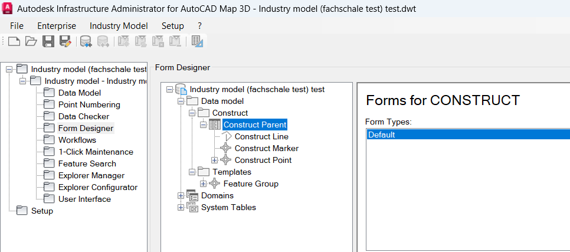
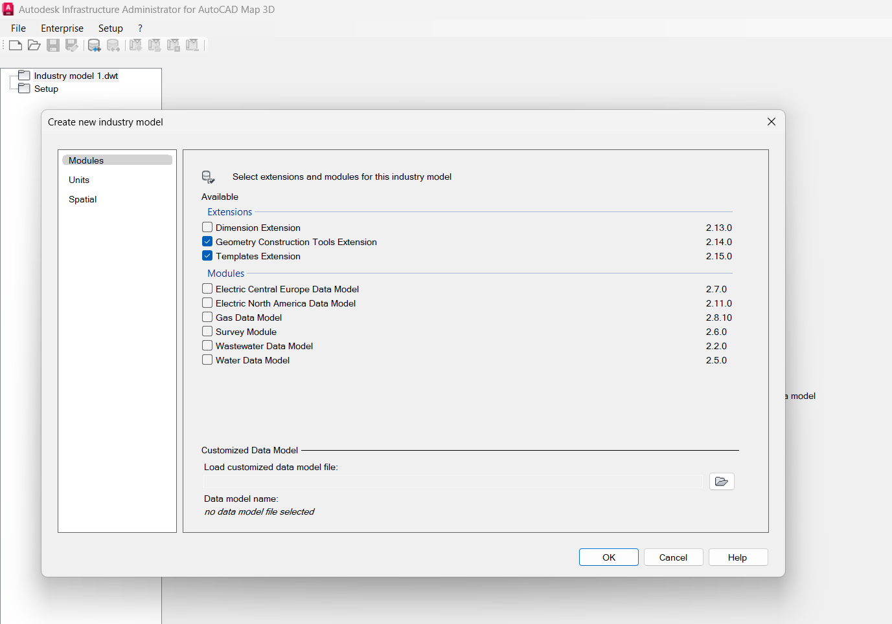
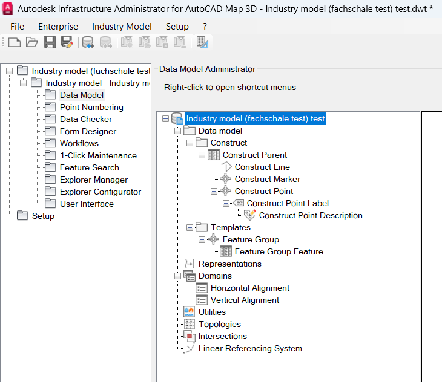
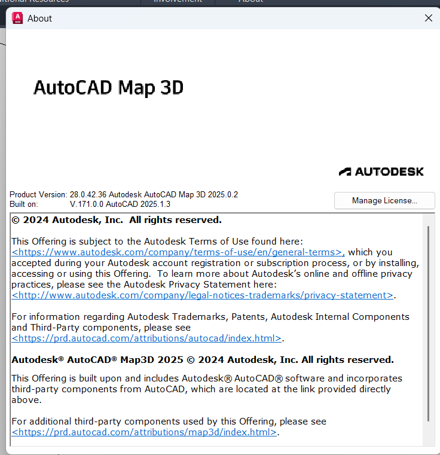
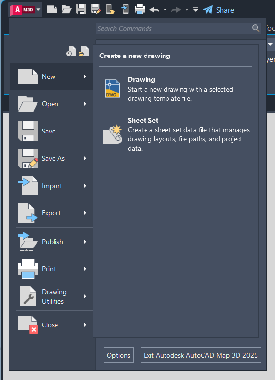
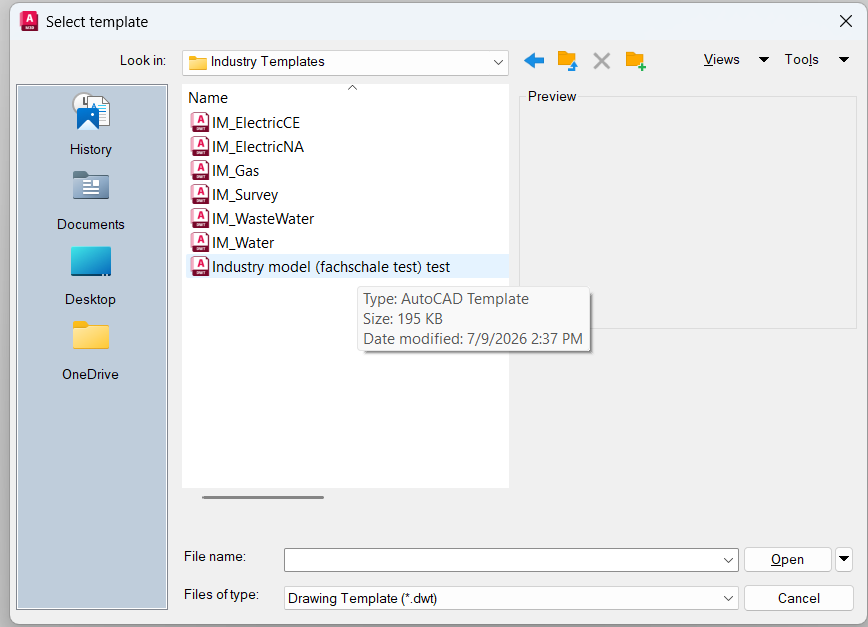
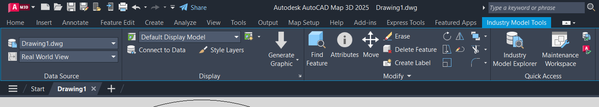
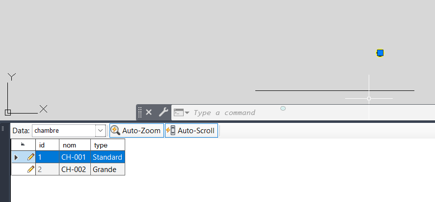

# Deliverable 1 | Autodesk Architecture: Infrastructure Administrator & AutoCAD Map 3D

## 1. Introduction

Autodesk is a design software company whose technologies cover architecture, engineering, construction, product design, manufacturing, media, and entertainment [8]. In this context, it provides the AutoCAD Map 3D suite and its Infrastructure Administrator module, which are used in this project to manage infrastructure data.

This document presents the discovery and hands-on experience with the two Autodesk tools at the core of the project: Infrastructure Administrator, which manages data structures (Data Model, Fachschale), and AutoCAD Map 3D, the client tool used to visualize and manipulate geospatial data. The goal of this phase is to understand the role of each component before addressing the migration to PostgreSQL/PostGIS.

## 2. Infrastructure Administrator

### 2.1 Overview

Infrastructure Administrator is the configuration module integrated into AutoCAD Map 3D, used to parameterize and manage projects and Industry Models (*Fachschalen*), operating either with a file-based Industry Model or an enterprise Industry Model [1].

Infrastructure Administrator is used to create forms and reports, job management rules, configure users and user groups, manage projects, documents, and settings, as well as customize workflows and create/modify data models [1].

It differs from other Autodesk modules: for instance, the Industry Model Setup module is used to configure pre-built sector models for domains like water, gas, wastewater, or electricity with their own data models, display rules, and business logic [3], whereas Infrastructure Administrator remains the generic tool for configuring and managing *Fachschalen*.

Infrastructure Administrator is organized into several complementary sub-modules:
- **Datenmodell-Administrator** (Data Model Administrator): Allows creating and modifying object classes, adding attributes to these classes, managing domain value tables, labels, topologies, and defining object rules.
- **Form Designer**: Allows customizing forms associated with each object class, with the ability to define multiple forms for a single class.

This sub-module organization was verified directly within the interface: Data Model Administrator and Form Designer are accessible and illustrated (see 2.2 and Form Designer screenshot).


*Opening Form Designer in Infrastructure Administrator for the "Construct Parent" object class of the test Fachschale. A default form ("Default") is offered for data entry/viewing of this class, with the option to define additional forms based on business requirements.*

### 2.2 Creating a Test Fachschale

A *Fachschale* (translated into English as Industry Model) is a domain data model created via Infrastructure Administrator, which defines the set of object classes, attributes, and rules for a given infrastructure domain (electric network, water, gas, etc.) [5]. It forms the reference structure subsequently used by AutoCAD Map 3D to display and manipulate data.

It can be either file-based or database-based: a database-based *Fachschale* is a dedicated Oracle or SQL Server database, while a file-based *Fachschale* uses SQLite as its storage engine and is embedded inside a DWG file [1]. To configure it, Autodesk Infrastructure Administrator is started, and connection is made to the relevant database if applicable [4]. To understand its practical operation, a test *Fachschale* was created step-by-step.


*Launching the creation process: opening Data Model Administrator and starting the wizard to create a new Fachschale.*


*Data model hierarchy generated in Data Model Administrator. It shows the domain structure of the Fachschale: object classes (Construct Parent, Construct Line, Construct Marker, Construct Point with its label and description), organized under Data model > Construct, as well as Templates (Feature Group), Domains (Horizontal/Vertical Alignment), and other available components (Topologies, Intersections, Linear Referencing System). This hierarchy corresponds to the logical definition of the schema as configured via Infrastructure Administrator.*


*Physical translation of this data model into the SQLite file generated by the Fachschale. Each object class from the previous hierarchy becomes an SQLite table (CONSTRUCT, CONSTRUCT_LINES, CONSTRUCT_MARKERS, CONSTRUCT_POINTS, CONSTRUCT_POINTS_TBL), accompanied by standard spatial metadata tables (fdo_columns, geometry_columns, spatial_ref_sys). The detail of columns in CONSTRUCT_POINTS_TBL (FID, FID_PARENT, GEOM, HORIZONTAL_ALIGNMENT, LABEL_DEF_ID, LABEL_TEXT, ORIENTATION, PRE, SUF) demonstrates how a domain object defined in the Fachschale translates into database columns.*

## 3. AutoCAD Map 3D (Client Side)

AutoCAD Map 3D is a GIS mapping and spatial analysis software integrated into AutoCAD, built on a data model that combines Computer-Aided Design (CAD) capabilities with advanced GIS tools for planning, designing, and managing infrastructure [2].

It provides direct access to spatial data via Feature Data Objects (FDO) technology, allows editing geospatial data, and manages enterprise industry models.

AutoCAD Map 3D serves as the bridge between CAD and GIS, granting direct access to major data formats used in design and GIS alike [7]. It is the client tool that operates the *Fachschale* created in Infrastructure Administrator: displaying maps, viewing/modifying object attributes, and connecting to existing Industry Models.

The project specifications (cdc; internship thesis cec|projekt GmbH, July 1st, 2026) specify the required version configuration:

| Requirement (cdc)             | Required Version |
|:-----------------------------:|:----------------:|
| Autodesk AutoCAD Map 3D       |  2025.0.2        |
| AutoCAD (base version)        |  2025.1.3        |


*AutoCAD Map 3D "About" window confirming the installed workstation version: Product Version 28.0.42.36 — Autodesk AutoCAD Map 3D 2025.0.2, built on AutoCAD 2025.1.3.*

--> The installed version (AutoCAD Map 3D 2025.0.2 on AutoCAD 2025.1.3 base) matches the exact requirements of the project specifications.

### 3.1 Connecting to an Existing Industry Model


*Opening the connection dialog in AutoCAD Map 3D (Data Connect / connect to a data store): selecting the provider to connect to the previously created Fachschale (Industry Model).*


*Connection configuration: selecting or entering the path/file of the Fachschale to connect, and validating connection parameters.*


*Connection result: the Fachschale appears in AutoCAD Map 3D's Display Manager, confirming that the data model created in Infrastructure Administrator is properly recognized client-side.*

### 3.2 Navigation and Map Display

*Map view displayed in Map 3D after connection, showing objects/entities from the data model (defined in the Fachschale).*

### 3.3 Attribute Viewing


*Selecting an object on the map and displaying its attribute table, illustrating the link between the structure defined in the Fachschale and the data manipulated client-side.*

## 4. Synthesis — Link Between the Two Tools

The *Fachschale* created in Infrastructure Administrator (2.2) defines the domain schema of the project, physically stored in an SQLite file (file-based mode). This same schema becomes directly usable on the client side once connected in AutoCAD Map 3D (3.1): the object classes defined in Data Model Administrator (Construct Parent, Construct Line, Construct Marker, Construct Point) are those retrieved and manipulated on the map display (3.2) and in attribute panels (3.3).

This diagram summarizes the official Autodesk architecture as observed in this project:

```
(Model Design / Administration)
 ┌───────────────────────────┐
 │  Infrastructure           │  
 │  Administrator            │  
 └──────────────┬────────────┘
                │  creates / updates
                ▼
(Schema: Object classes, attributes)
 ┌───────────────────────────┐
 │      Data Model           │   
 └──────────────┬────────────┘
                │  instantiated in
                ▼
 ┌───────────────────────────┐
 │   Industry Model          │
 │  (Fachschale)             │
 └──────────────┬────────────┘
                │  stored in
      ┌─────────┴─────────┐
      ▼                   ▼
 ┌───────────┐       ┌──────────────┐
 │ Oracle    │       │ SQL Server   │
 │ (DB-based)│       │ (DB-based)   │
 └───────────┘       └──────────────┘
                │
                │  or file-based mode:
                ▼
      ┌─────────────────────┐
      │ SQLite inside DWG   │
      │ (file-based)        │
      └─────────────────────┘

      ┌ reads/writes via native Oracle/SQL Server driver
      ▼ 
 ┌───────────────────────────┐
 │  AutoCAD Map 3D           │  
 └───────────────────────────┘
```

## 5. Resources

[1] Infrastructure Administrator Handbuch — Infrastructure Map Server 2016, Autodesk Knowledge Network
 https://knowledge.autodesk.com/de/support/infrastructure-map-server/learn-explore/caas/CloudHelp/cloudhelp/2016/DEU/MapServer-Help/files/GUID-322F55A9-32AA-4760-970B-7AF72BDD1611-htm.html

[2] Map 3D Toolset in Autodesk AutoCAD | Features, Autodesk
https://www.autodesk.com/products/autocad/included-toolsets/autocad-map-3d

[3] What exactly are these modules used for: Industry Model Setup, Data Editor, Infrastructure Administrator (AutoCAD Map 3D) — Autodesk Support
 https://www.autodesk.com/support/technical/article/caas/sfdcarticles/sfdcarticles/What-exactly-are-these-modules-used-for-Industry-Model-Setup-for-AutoCAD-Map-3D-Industry-Model-Data-Editor-for-AutoCAD-Map-3D-Infrastructure-Administrator-for-AutoCAD-Map-3D.html

[4] Einführung und erste Schritte — NET Hilfe-Center, TKI Chemnitz
 https://help.tki-chemnitz.de/hc/de/articles/360015691619-Einf%C3%BChrung-und-erste-Schritte

[5] Autodesk Infrastructure Administrator — NET Hilfe-Center, TKI Chemnitz
 https://help.tki-chemnitz.de/hc/de/sections/360004459420-Autodesk-Infrastructure-Administrator

[7] AutoCAD Map 3D User's Guide — Overview of Features, Autodesk
 https://www.scribd.com/doc/200072761/Autocad-Map-3d-User-s-Guide

[8] About Us — Autodesk Company Info, Mission, and Values
https://www.autodesk.com/company
