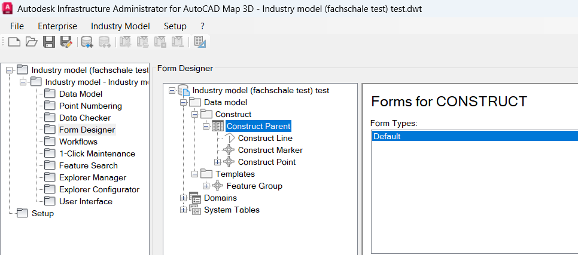
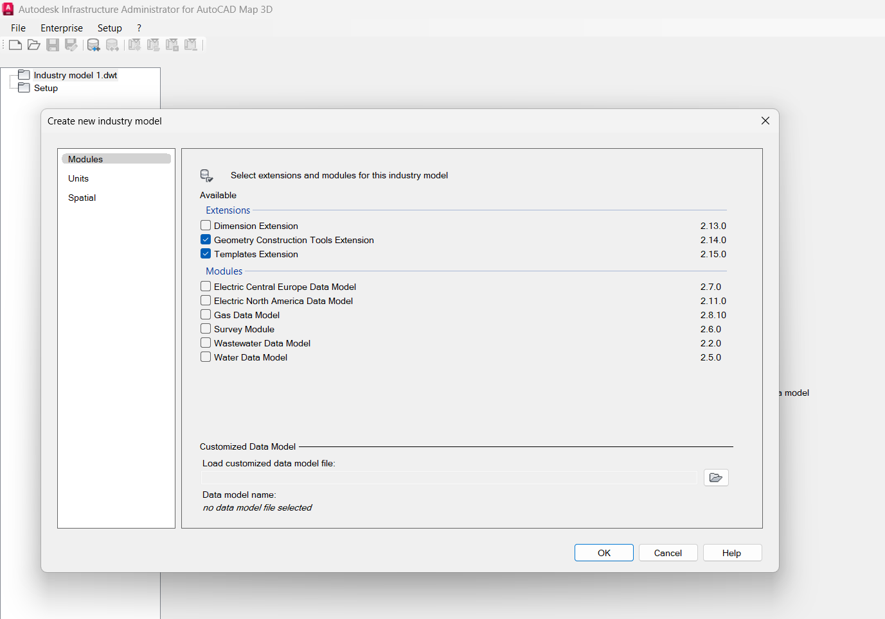
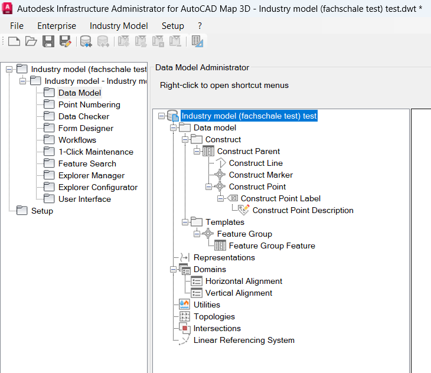
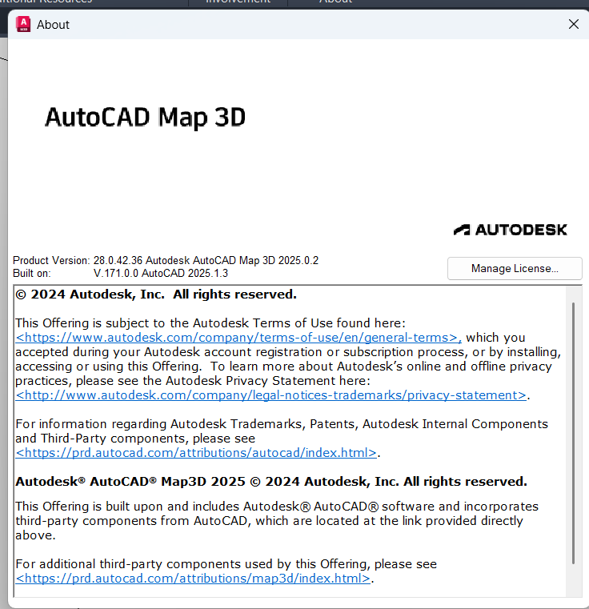
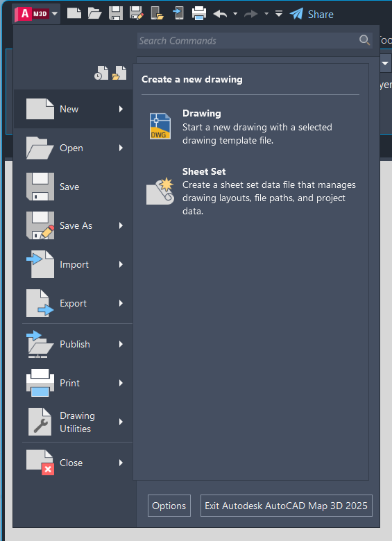
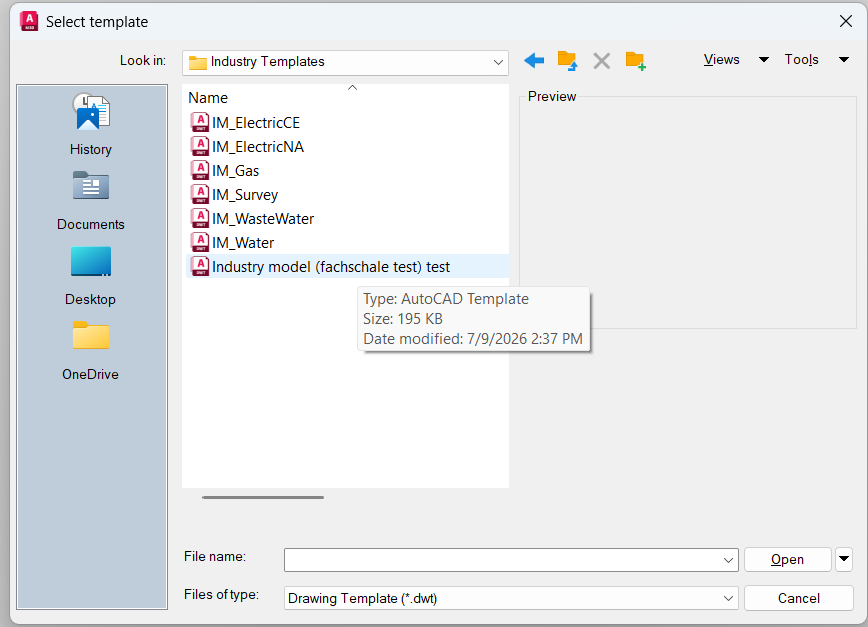
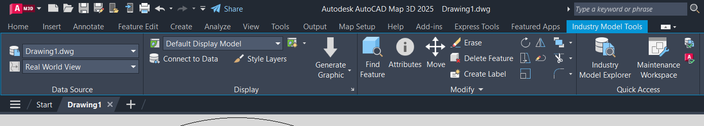
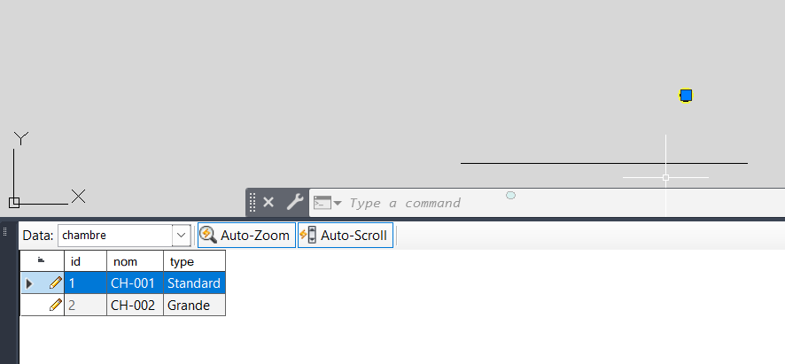

# Livrable 1 | Architecture Autodesk : Infrastructure Administrator & AutoCAD Map 3D 

## 1. Introduction

Autodesk est une entreprise éditrice de logiciels de conception, dont les technologies couvrent notamment l'architecture, l'ingénierie et la construction, la conception et la fabrication de produits, ainsi que les médias et le divertissement [8]. C'est dans ce contexte qu'elle propose la suite AutoCAD Map 3D et son module Infrastructure Administrator, utilisés dans ce projet pour la gestion de données d'infrastructure.
   
Ce document présente la découverte et la prise en main des deux outils Autodesk au cœur du projet : Infrastructure Administrator, qui gère la structure des données (Data Model, Fachschale), et AutoCAD Map 3D, l'outil client utilisé pour visualiser et manipuler les données géospatiales. L'objectif de cette phase est de comprendre le rôle de chaque composant avant d'aborder la problématique de migration vers PostgreSQL/PostGIS.

## 2. Infrastructure Administrator
   
### 2.1 Présentation générale

Infrastructure Administrator est le module de configuration intégré dans AutoCAD Map 3D et utilisé pour paramétrer et gérer des projets et des Industry Models (Fachschalen), pouvant fonctionner aussi bien avec un Industry Model basé sur fichier qu'avec un Industry Model d'entreprise [1].

Infrastructure Administrator sert à créer des formulaires et des rapports, des règles de gestion des jobs, à configurer des utilisateurs et groupes d'utilisateurs, à gérer des projets, documents et paramètres, ainsi qu'à personnaliser les flux de travail et créer/modifier des modèles de données [1]. 

Il se distingue des autres modules Autodesk : le module Industry Model Setup, par exemple, sert plutôt à configurer des modèles sectoriels préconfigurés pour des secteurs comme l'eau, le gaz, l'assainissement ou l'électricité, avec leurs propres modèles de données, d'affichage et règles métier [3], alors qu'Infrastructure Administrator reste l'outil générique de configuration et de gestion des Fachschalen.

Infrastructure Administrator s'organise en plusieurs sous-modules complémentaires: 
- **Le Datenmodell-Administrator** (Data Model Administrator) permet de créer et modifier des classes d'objets, d'ajouter des attributs à ces classes, de gérer les tables de domaines de valeurs, les labels, les topologies, et de définir des règles d'objets. 
- **Le Formulaire-Designer** permet de personnaliser les formulaires associés à chaque classe d'objets, avec la possibilité d'en définir plusieurs pour une même classe. 

Cette organisation en sous-modules a été vérifiée directement dans l'interface : le Data Model Administrator et le Form Designer sont accessibles et ont pu être illustrés (voir 2.2 et Photo Form Designer).
  

*Ouverture du Form Designer dans Infrastructure Administrator, pour la classe d'objets "Construct Parent" de la Fachschale de test. Un formulaire par défaut ("Default") est proposé pour la saisie/consultation des données de cette classe, avec la possibilité d'en définir d'autres selon les besoins métier.*

### 2.2 Création d'une Fachschale de test

Une Fachschale (traduit en anglais par Industry Model) est un modèle de données métier créé via Infrastructure Administrator, qui définit l'ensemble des classes d'objets, de leurs attributs et de leurs règles pour un domaine d'infrastructure donné (réseau électrique, eau, gaz, etc.) [5]. Elle constitue la structure de référence exploitée ensuite par AutoCAD Map 3D pour l'affichage et la manipulation des données.

Elle peut être soit basée sur fichier, soit basée sur base de données : une Fachschale basée sur base de données est une base Oracle ou SQL Server dédiée, tandis qu'une Fachschale basée sur fichier utilise SQLite comme moteur de stockage et est intégrée dans un fichier DWG [1]. Pour la configurer, on démarre Autodesk Infrastructure Administrator, puis on se connecte le cas échéant à la base de données concernée [4]. Pour comprendre concrètement son fonctionnement, une Fachschale de test a été créée pas à pas. 
  

*Lancement du processus de création : ouverture du Data Model Administrator et démarrage de l'assistant de création d'une nouvelle Fachschale.*
  

*Arborescence du modèle de données généré dans le Data Model Administrator. On y retrouve la structure métier de la Fachschale : les classes d'objets (Construct Parent, Construct Line, Construct Marker, Construct Point avec son label et sa description), organisées sous Data model > Construct, ainsi que les Templates (Feature Group), les Domains (Horizontal/Vertical Alignment) et les autres composants disponibles (Topologies, Intersections, Linear Referencing System). Cette arborescence correspond à la définition logique du schéma, telle que configurée via Infrastructure Administrator.*
  

*Traduction physique de ce modèle de données dans le fichier SQLite généré par la Fachschale. Chaque classe d'objets de l'arborescence précédente devient une table SQLite (CONSTRUCT, CONSTRUCT_LINES, CONSTRUCT_MARKERS, CONSTRUCT_POINTS, CONSTRUCT_POINTS_TBL), accompagnée de tables de métadonnées spatiales standard (fdo_columns, geometry_columns, spatial_ref_sys). Le détail des colonnes de CONSTRUCT_POINTS_TBL (FID, FID_PARENT, GEOM, HORIZONTAL_ALIGNMENT, LABEL_DEF_ID, LABEL_TEXT, ORIENTATION, PRE, SUF) illustre concrètement comment un objet métier défini dans la Fachschale se traduit en colonnes exploitables en base.*
 
## 3. AutoCAD Map 3D (côté client)

AutoCAD Map 3D est un logiciel de cartographie et d’analyse SIG (système d'information géographique) intégré à AutoCAD , basé sur un modèle de données et combine les fonctionnalités de dessin assisté par ordinateur (DAO/CAO) avec des outils SIG avancés pour la planification, la conception et la gestion des infrastructures.[2]

Il permet d’accéder directement aux données spatiales via la technologie FDO (Feature Data Objects), de modifier des données géospatiales et de gérer des modèles métier d’entreprise

AutoCAD Map 3D est la solution qui fait le pont entre la DAO/CAO et les SIG, en donnant un accès direct aux principaux formats de données utilisés en conception comme en SIG [7]. C'est l'outil client qui exploite concrètement la Fachschale créée dans Infrastructure Administrator : afficher la carte, consulter/modifier les attributs des objets, et se connecter à un Industry Model existant. 

Le cahier des charges du stage (cdc ; mémoire de stage cec|projekt GmbH, 1er juillet 2026) précise la configuration requise pour le projet :

| Exigence (cdc)                | Version demandée |
|:-----------------------------:|:----------------:|
| Autodesk AutoCAD Map 3D       |  2025.0.2        |
| AutoCAD (version de base)     |  2025.1.3        |
 

*Fenêtre "About" d'AutoCAD Map 3D confirmant la version installée sur le poste de travail : Product Version 28.0.42.36 — Autodesk AutoCAD Map 3D 2025.0.2, construite sur AutoCAD 2025.1.3.*

--> La version installée (AutoCAD Map 3D 2025.0.2, sur base AutoCAD 2025.1.3) correspond exactement à celle exigée dans le cahier des charges. L'environnement de travail est donc conforme aux prérequis techniques du projet dès cette Phase 1.

### 3.1 Connexion à un Industry Model existant

*Ouverture de la boîte de dialogue de connexion dans AutoCAD Map 3D (Data Connect / connexion à un magasin de données) : sélection du fournisseur permettant de se connecter à la Fachschale (Industry Model) créée précédemment.*
  

*Paramétrage de la connexion : sélection ou saisie du chemin/fichier de la Fachschale à connecter, et validation des paramètres de connexion.* 
  

*Résultat de la connexion : la Fachschale apparaît dans le Display Manager d'AutoCAD Map 3D, confirmant que le modèle de données créé dans Infrastructure Administrator est bien reconnu côté client.*

### 3.2 Navigation et affichage de la carte

 *Vue de la carte affichée dans Map 3D après connexion, montrant les objets/entités issus du modèle de données (définis dans la Fachschale).*

### 3.3 Consultation des attributs

 *Sélection d'un objet sur la carte et affichage de son tableau d'attributs, illustrant le lien entre la structure définie dans la Fachschale et les données manipulées côté client.*

## 4. Synthèse — Lien entre les deux outils
   
La Fachschale créée dans Infrastructure Administrator (2.2) définit le schéma métier du projet, matérialisé physiquement par un fichier SQLite (mode fichier ci-dessous). Ce même schéma devient directement exploitable côté client une fois la connexion établie dans AutoCAD Map 3D (3.1) : les classes d'objets définies dans le Data Model Administrator (Construct Parent, Construct Line, Construct Marker, Construct Point) sont celles que l'on retrouve et manipule concrètement dans la carte affichée (3.2) et dans les panneaux d'attributs consultés (3.3).

Ce schéma résume l'architecture officielle Autodesk telle qu'observée concrètement dans ce projet (la Fachschale de test utilisée étant en mode fichier / SQLite).

(conception / administration du modèle)
 ┌───────────────────────────┐
 │  Infrastructure           │  
 │  Administrator            │  
 └──────────────┬────────────┘
                │  crée / met à jour
                ▼
(schéma : classes d'objets, attributs)
 ┌───────────────────────────┐
 │      Data Model           │   
 └──────────────┬────────────┘
                │  matérialisé dans
                ▼
 ┌───────────────────────────┐
 │   Industry Model          │
 │  (Fachschale)             │
 └──────────────┬────────────┘
                │  stocké dans
      ┌─────────┴─────────┐
      ▼                   ▼
 ┌───────────┐       ┌──────────────┐
 │ Oracle    │       │ SQL Server   │
 │ (DB-based)│       │ (DB-based)   │
 └───────────┘       └──────────────┘
                │
                │  ou bien, mode fichier :
                ▼
      ┌─────────────────────┐
      │ SQLite dans un DWG  │
      │ (file-based)        │
      └─────────────────────┘

      ┌ lit/écrit via le driver  Oracle/SQL Server natif
      ▼ 
 ┌───────────────────────────┐
 │  AutoCAD Map 3D           │  
 └───────────────────────────┘

## 5. Ressources
   
[1] Infrastructure Administrator Handbuch — Infrastructure Map Server 2016, Autodesk Knowledge Network
 https://knowledge.autodesk.com/de/support/infrastructure-map-server/learn-explore/caas/CloudHelp/cloudhelp/2016/DEU/MapServer-Help/files/GUID-322F55A9-32AA-4760-970B-7AF72BDD1611-htm.html

[2] Map 3D Toolset in Autodesk AutoCAD | Features, Autodesk
https://www.autodesk.com/products/autocad/included-toolsets/autocad-map-3d

[3] What exactly are these modules used for: Industry Model Setup, Data Editor, Infrastructure Administrator (AutoCAD Map 3D) — Autodesk Support
 https://www.autodesk.com/support/technical/article/caas/sfdcarticles/sfdcarticles/What-exactly-are-these-modules-used-for-Industry-Model-Setup-for-AutoCAD-Map-3D-Industry-Model-Data-Editor-for-AutoCAD-Map-3D-Infrastructure-Administrator-for-AutoCAD-Map-3D.html

[4] Einführung und erste Schritte — NET Hilfe-Center, TKI Chemnitz
 https://help.tki-chemnitz.de/hc/de/articles/360015691619-Einf%C3%BChrung-und-erste-Schritte

[5] Autodesk Infrastructure Administrator — NET Hilfe-Center (sommaire), TKI Chemnitz
 https://help.tki-chemnitz.de/hc/de/sections/360004459420-Autodesk-Infrastructure-Administrator

[7] AutoCAD Map 3D User's Guide — Overview of Features, Autodesk
 https://www.scribd.com/doc/200072761/Autocad-Map-3d-User-s-Guide

[8] About Us — Autodesk Company Info, Mission, and Values
https://www.autodesk.com/company

