# 03 — Analyse et Reverse Engineering du Data Model Autodesk

> **Phase 3 du projet de recherche** — Compréhension du fonctionnement interne des Industry Models Autodesk en vue du développement d'un convertisseur automatique Data Model Autodesk → PostgreSQL/PostGIS.

---

## Sommaire

1. [Objectif de la phase](#1-objectif-de-la-phase)
2. [Principe du reverse engineering](#2-principe-du-reverse-engineering)
3. [Outils utilisés](#3-outils-utilisés)
4. [Campagne complète de tests](#4-campagne-complète-de-tests)
5. [Tableau de suivi](#5-tableau-de-suivi)
6. [Analyse finale](#6-analyse-finale)
7. [Conclusion](#7-conclusion)

---

## 1. Objectif de la phase

### 1.1 Pourquoi cette phase est la plus critique du projet

Le projet global vise à terme à produire un outil capable de lire un **Data Model Autodesk** (tel qu'il est défini dans **Autodesk Infrastructure Administrator**) et de générer automatiquement un **schéma PostgreSQL/PostGIS** strictement équivalent, sans dépendre d'Oracle ni de SQL Server comme bases de stockage intermédiaires.

Un tel convertisseur ne peut être conçu correctement que si l'on comprend **exactement** comment Autodesk traduit, en interne, les concepts manipulés dans l'interface graphique (classes, attributs, domaines, relations, représentations graphiques, etc.) en structures relationnelles concrètes. Cette phase 3 est donc la **fondation technique** de tout le reste du projet :

- Toute erreur d'interprétation à ce stade se répercutera mécaniquement sur la phase de génération du schéma PostgreSQL/PostGIS.
- Le mapping conceptuel construit ici (« telle notion du Data Model = telle(s) table(s)/colonne(s) SQLite ») constituera la **spécification fonctionnelle** du futur moteur de conversion.
- Sans cette phase, tout développement ultérieur reposerait sur des suppositions non vérifiées, ce qui est inacceptable dans un contexte de recherche rigoureux ou de mémoire de fin d'études.

> **Remarque**
> Cette phase ne vise pas à produire du code, mais à produire de la **connaissance vérifiée et documentée**. Le code viendra dans une phase ultérieure, une fois le modèle interne stabilisé.

### 1.2 Deux représentations d'un même objet

Il est essentiel de bien distinguer **deux couches** qui décrivent, chacune à sa manière, le même Data Model :

1. **La couche conceptuelle / applicative** : le Data Model tel qu'il est **visible et manipulable** dans Infrastructure Administrator (arborescence des classes, propriétés, domaines, relations, styles de représentation, etc.). C'est la vue destinée à l'utilisateur métier.
2. **La couche physique / de stockage** : la **représentation réelle** de ce même Data Model, persistée dans un fichier **SQLite** (extension généralement `.sqlite` ou équivalent selon la configuration du dépôt). C'est cette couche qui nous intéresse en priorité, car c'est elle qui devra être lue par notre futur outil de conversion.

```
┌──────────────────────────────────────┐
│      Infrastructure Administrator    │
│   (vue conceptuelle / interface UI)  │
│                                      │
│   Classe "Vanne"                     │
│     ├─ Attribut "Diametre" (Double)  │
│     ├─ Attribut "Materiau" (Domaine) │
│     └─ Géométrie (Point)             │
└──────────────────┬───────────────────┘
                   │  persistance interne
                   ▼
┌──────────────────────────────────────┐
│         Fichier SQLite (moteur)      │
│      (vue physique / relationnelle)  │
│                                      │
│  Table CLASSDEFINITION               │
│  Table ATTRIBUTEDEFINITION           │
│  Table DOMAIN                        │
│  Table GEOMETRYDEFINITION            │
│  ... (noms indicatifs, à vérifier)   │
└──────────────────────────────────────┘
```

L'objectif de cette phase est de construire, **empiriquement et avec preuves**, la table de correspondance entre ces deux couches.

### 1.3 Ce que cette phase doit produire concrètement

À l'issue de cette phase, nous devons disposer de :

- Une cartographie du schéma SQLite du Data Model.
- Une compréhension claire de la manière dont chaque concept métier (classe, attribut, domaine, relation, géométrie, label, template, héritage) est traduit en lignes/colonnes.
- Un ensemble de captures d'écran et de diffs SQLite servant de preuves reproductibles.
- Un tableau de suivi rempli, exploitable comme base de spécification pour le développement du convertisseur PostgreSQL/PostGIS.

---

## 2. Principe du reverse engineering

### 2.1 Méthodologie générale

La méthodologie retenue est celle du **reverse engineering par différentiel contrôlé** (differential analysis). Le principe est simple dans son énoncé mais exigeant dans son exécution : on observe l'effet, dans le fichier SQLite, d'**une seule modification connue et maîtrisée** effectuée dans Infrastructure Administrator.

> **Remarque**
> Cette approche s'inspire des techniques classiques de rétro-ingénierie de formats de fichiers propriétaires : on ne cherche pas à « deviner » la structure, on la **déduit** d'observations reproductibles.

### 2.2 Règle absolue : une seule modification à la fois

**Il ne faut jamais modifier plusieurs paramètres simultanément.**

Cette règle est la pierre angulaire de toute la démarche. Si l'on modifie deux paramètres en même temps (par exemple ajouter un attribut *et* changer une de ces propriétés dans la même opération), il devient impossible de savoir laquelle des deux modifications est responsable de tel ou tel changement observé dans le SQLite. Le diff perd alors toute valeur probante.

> **À vérifier**
> Certaines opérations d'Infrastructure Administrator peuvent déclencher des effets de bord automatiques (par exemple la création implicite d'un index ou d'une contrainte). Il faudra bien distinguer, dans les observations, ce qui relève de la modification volontaire de ce qui relève d'un effet de bord du logiciel.

### 2.3 Cycle opératoire

Chaque test suit rigoureusement le cycle suivant :

```
   ┌──────────────────────────┐
   │   Modification unique    │
   └────────────┬─────────────┘
                ▼
   ┌──────────────────────────┐
   │        Sauvegarde        │
   └────────────┬─────────────┘
                ▼
   ┌──────────────────────────┐
   │     Extraction des       │
   │      fichiers .sql       │
   └────────────┬─────────────┘
                ▼
┌─────────────────────────────────────┐
│ Lancement du script de comparaison  │
│ et generation du rapport de diff    │
└───────────────┬─────────────────────┘
                ▼
   ┌──────────────────────────┐
   │        Observation       │
   └────────────┬─────────────┘
                ▼
   ┌──────────────────────────┐
   │         Déduction        │
   └──────────────────────────┘
```

1. **Modification unique** : réaliser une seule action précise dans Infrastructure Administrator (ex. : ajout d'un attribut).
2. **Sauvegarde** : enregistrer le Data Model pour forcer la persistance dans le fichier SQLite sous-jacent.
3. **Extraction des fichiers .sql** : extraire les fichiers .sql (schema et dump) du Data Model.
4. **Lancement du script de comparaison et generation du rapport de diff** : comparer l'état du schéma/des données avec la copie précédente (avant modification).
5. **Observation** : noter précisément quelles tables, colonnes et valeurs ont changé.
6. **Déduction** : formuler une hypothèse sur le rôle de chaque table/colonne concernée.

### 2.4 Traçabilité systématique

Toutes les observations doivent être consignées dans le **tableau de suivi** (voir [section 5](#5-tableau-de-suivi)), sans exception, y compris lorsque le résultat d'un test est négatif ou inattendu (« aucun changement observé » est en soi une information précieuse).

> **Observation**
> Un test qui ne produit aucune modification visible dans le SQLite est tout aussi important qu'un test qui en produit une : il peut indiquer que la donnée est calculée dynamiquement, mise en cache ailleurs, ou stockée dans un fichier annexe non encore identifié.

---

## 3. Outils utilisés

| Outil | Rôle dans la démarche |
|---|---|
| **Infrastructure Administrator** | Interface graphique Autodesk permettant de créer, modifier et gérer le Data Model (classes, attributs, domaines, relations, représentations). C'est l'outil qui **génère** les modifications que nous allons observer. |
| **SQL Sheet** | Interface d'exécution de requêtes SQL (intégrée à l'environnement de travail) permettant d'interroger directement le contenu des tables SQLite via des requêtes `SELECT` ciblées, utile pour vérifier rapidement une hypothèse sans naviguer manuellement dans l'interface graphique. |
| **sqlite3 CLI** | Outil en ligne de commande permettant d'automatiser l'export du schéma (`.schema`), l'export de données (`.dump`), et la production de fichiers texte comparables entre deux états du Data Model. Indispensable pour produire des diffs reproductibles et scriptables. |
| **Script Python de comparaison** | Script Python utilisant sqlite3 permettant de mettre en évidence automatiquement les différences entre l'export « avant » et l'export « après » d'un test. C'est l'outil qui matérialise concrètement l'étape « Comparaison » du cycle opératoire. |

> **Remarque**
> L'usage combiné de `sqlite3 .schema` (pour le schéma) et `sqlite3 .dump` (pour les données) avant/après chaque test, associé à un `script de comparaison`, constitue la méthode la plus fiable et la plus reproductible. SQL Sheet sert surtout à l'exploration exploratoire et à la vérification visuelle des hypothèses.

### 3.1 Procédure type d'extraction pour comparaison

# Avant modification
sqlite3 datamodel.sqlite ".schema" > schema_avant.sql
sqlite3 datamodel.sqlite ".dump"   > dump_avant.sql

# ... réalisation de la modification unique dans Infrastructure Administrator ...
# ... sauvegarde du Data Model ...

# Après modification
sqlite3 datamodel.sqlite ".schema" > schema_apres.sql
sqlite3 datamodel.sqlite ".dump"   > dump_apres.sql

Nous avons automatisé la comparaison en développant un script Python dédié (`compare_sqlite.py`) qui se charge de vérifier en profondeur et d'isoler de façon intelligente les différences de schémas et de données (dump) plutôt que d'utiliser de simples diff textuels :

```bash
# Lancement de l'outil de comparaison Python sur deux états
python compare_sqlite.py schema_testN.sql schema_testN1.sql \\
                              dump_testN.sql   dump_testN1.sql \\
                              -o rapport_testN_vs_testN1.md
```
---

## 4. Campagne complète de tests 

### Test 0 — État initial

- **Objectif** : établir une référence (baseline) avant toute modification, afin de disposer d'un point de comparaison pour tous les tests suivants.

- **Modification réalisée** : aucune. Il s'agit d'un état de référence.

- **Observation** : la liste complète des tables (170 tables en total , voir *Figure T0-03*) présentes par défaut, leurs colonnes, leurs types, ainsi que les données déjà présentes (tables système, métadonnées de version, etc.).

- **Tables SQLite modifiées** : inventaire initial, pas de modification.

- **Résultat** : un référentiel complet du schéma « à vide », servant de socle de comparaison pour tous les tests suivants.

- **Conclusion** : Présence de nombreuses tables système Autodesk (préfixées par TB_) générées par défaut à l'initialisation.

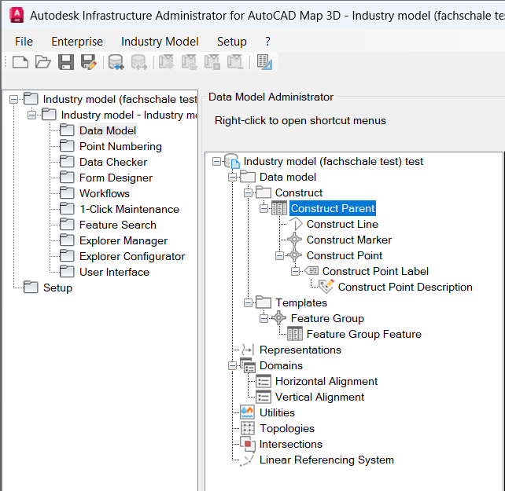
*Figure T0-01 -- Arborescence complète du Data Model*
<br><br>
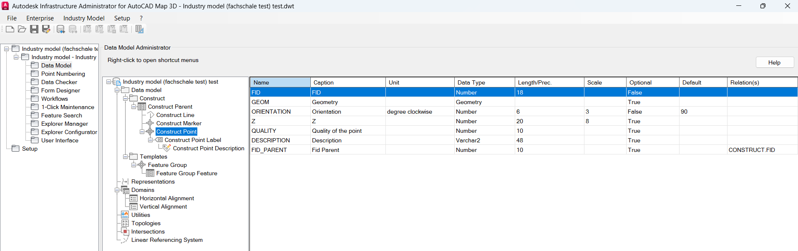
*Figure T0-02 -- La liste des attributs d'une classe*
<br><br>
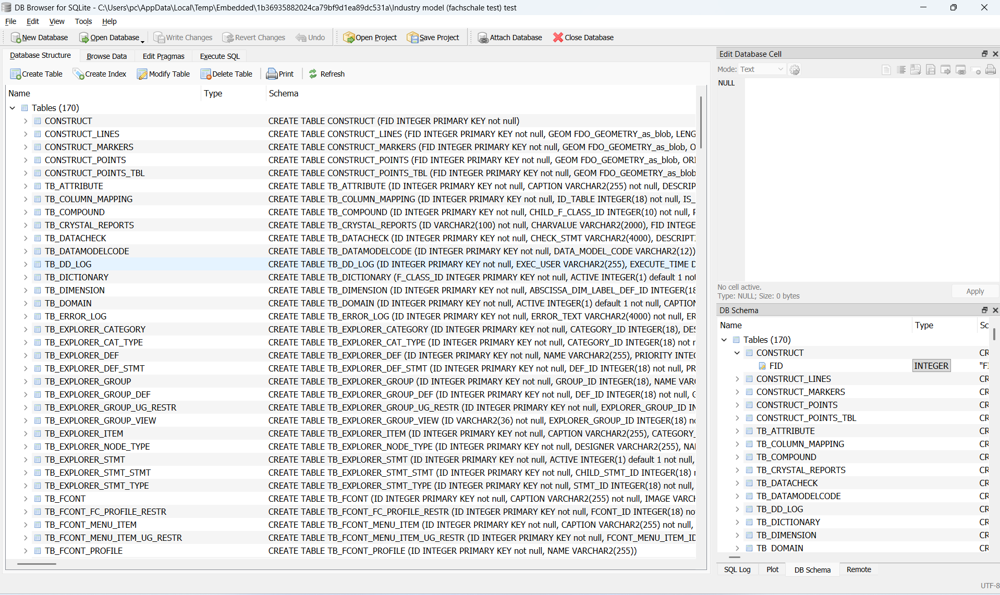
*Figure T0-03 -- DB Browser for SQLite*

### Test 1 — Ajout d'une classe

- **Objectif** : identifier la ou les tables responsables du stockage de la définition d'une classe (entité métier) du Data Model.

- **Modification réalisée** : création d'une nouvelle classe non géométrique `TEST_CLASSE_01`.

- **Observation** : création immédiate d'une véritable table physique nommée `TEST_CLASSE_01` accompagnée de 5 triggers SQLite automatisant les séquences d'ID (`_AD_FID`, `_AI_FID`, `_AU_FID`, `_BI_FID`, `_BU_FID`). On observe la création d'un identifiant métier (FID) géré en base de données ainsi qu'un impact lourd sur les configurations purement liées à l'interface utilisateur.

- **Tables SQLite modifiées** : au-delà du catalogue principal, les tables réellement appelées sont : `TB_DICTIONARY`*(1 ligne ajoutée)*, `TB_ATTRIBUTE`*(1 ligne)*, `fdo_columns`*(1 ligne)*, `TB_RULE_BASE`*(6 lignes)*, `TB_SEQUENCE_EMULATION`*(4 lignes)*, ainsi que les tables d'interface `TB_GN_DOCUMENT_BAR_ITEM`*(16 lignes)*, `TB_GN_FLYIN_USER`*(2 lignes)*, et `TB_SETTINGS`*(5 lignes).

- **Résultat** : ajout d'exactement 1 ligne métier dans `TB_DICTIONARY` définissant la classe (type et dimension), 1 ligne dans `TB_ATTRIBUTE` et `fdo_columns` pour déclarer la clé primaire `FID`, et 6 lignes de comportements dans `TB_RULE_BASE`. Par ailleurs, 23 pures lignes de formatage visuel sont injectées dans les `TB_GN_*` et `TB_SETTINGS`.

- **Conclusion** : `TB_DICTIONARY` est définitivement le catalogue maître des classes. De plus, la création d'une classe n'est pas qu'une simple ligne de registre : elle implique impérativement la création d'une table SQL réelle en arrière-plan, accompagnée de sa clé primaire `FID` documentée par le noyau FDO (`fdo_columns`).

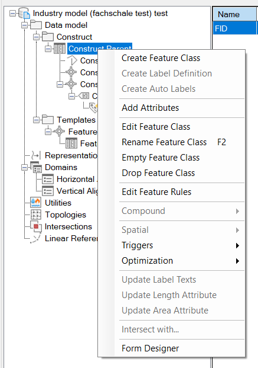
*Figure T1-01 -- Ajout d'une classe*
<br><br>
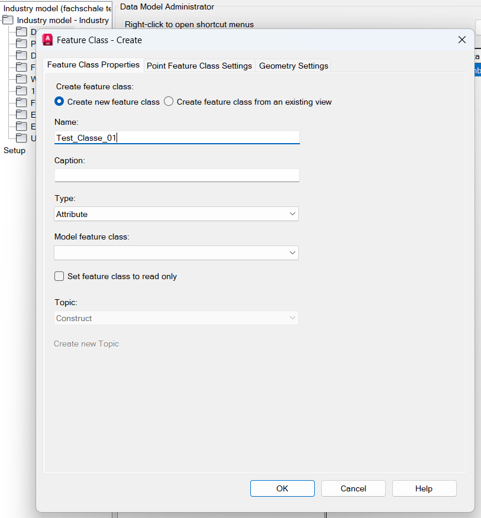
*Figure T1-02 -- Formulaire d'ajout*
<br><br>
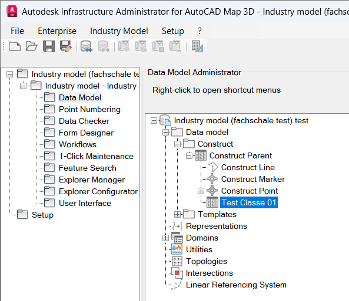
*Figure T1-03 -- Emplacement de la classe ajoutée*

### Test 2 — Ajout d'un attribut

- **Objectif** : identifier la table responsable du stockage des attributs (propriétés) d'une classe.

- **Modification réalisée** : ajout d'un attribut `TEST_ATTRIBUT_01`, type texte à la classe créée au Test 1 avec longueure max 10.

- **Observation** : modification directe de la structure SQL (DDL) de la table physique parente avec l'apparition d'une nouvelle colonne dimensionnée. La création de cet attribut s'accompagne de l'enregistrement de l'attribut dans des dictionnaires systèmes et d'une incrémentation de certaines séquences internes et tables d'interface.

- **Tables SQLite modifiées** : exécution d'un `ALTER TABLE` sur la table métier `TEST_CLASSE_01`. Les tables système impactées sont : `TB_ATTRIBUTE`*(1 ligne ajoutée)*, `fdo_columns`*(1 ligne ajoutée)*, `TB_SEQUENCE_EMULATION`*(1 ligne modifiée)*, et `TB_GN_FLYIN_USER`*(1 ligne modifiée)*.

- **Résultat** : ajout physique de la colonne `TEST_ATTRIBUT_01 (VARCHAR2(10))` à la table `TEST_CLASSE_01`. Ajout d'une ligne dans `TB_ATTRIBUTE` rattachant l'attribut à l'ID de sa classe mère (`F_CLASS_ID=8`). Ajout d'une ligne dans `fdo_columns` renseignant en dur les contraintes de type issues de l'interface (type texte = `fdo_data_type: 9`, longueur = `fdo_data_length: 10`).

- **Conclusion** : `TB_ATTRIBUTE` est le catalogue maître des définitions d'attributs. L'ajout d'une propriété dans Infrastructure Administrator se traduit toujours par la création physique immédiate d'une colonne dans la table SQL parente, accompagnée de l'enregistrement de son type exact et de limitations (longueur) dans la table système `fdo_columns`.

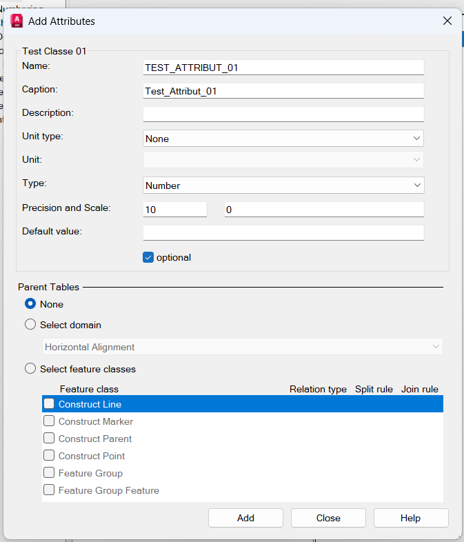
*Figure T2-01 -- Formulaire d'ajout d'un attribut*
<br><br>
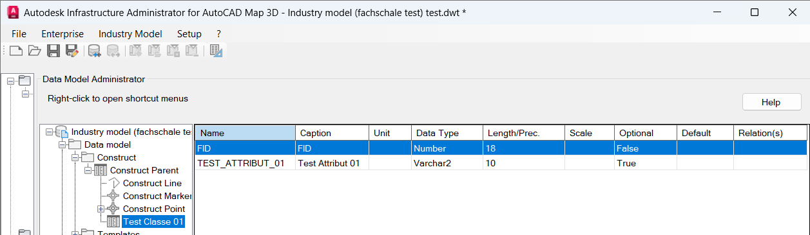
*Figure T2-02 -- Emplacement de l'attribut ajouté*
<br><br>

### Test 3 — Comparaison de deux attributs de types différents

- **Objectif** : identifier comment le type de données d'un attribut est encodé (chaîne littérale, code numérique, table de référence des types).

- **Modification réalisée** : ajout d'un nouvel attribut `TEST_ATTRIBUT_02` de type numérique (Nombre) avec une précision de 10.

- **Observation** : l'ajout d'un attribut d'un autre type génère un comportement identique à celui observé au test précédent (altération immédiate du schéma SQL de la classe parente), mais l'encodage des métadonnées du type diffère spécifiquement au sein de la table de formatage `fdo_columns`. 

- **Tables SQLite modifiées** : exécution d'un `ALTER TABLE` sur la table métier `TEST_CLASSE_01`. Les tables système impactées sont : `TB_ATTRIBUTE`*(1 ligne ajoutée)*, `fdo_columns`*(1 ligne ajoutée)*, et `TB_SEQUENCE_EMULATION`*(1 ligne modifiée)*. Notons l'absence formelle de table métier spécifiquement dédiée au stockage des types.

- **Résultat** : ajout physique de la colonne `TEST_ATTRIBUT_02 (INTEGER(10))` à la table `TEST_CLASSE_01`. Modification de l'incrément `TB_ATTRIBUTE_S` et création de l'enregistrement de l'attribut mère dans `TB_ATTRIBUTE`. Contrairement à l'attribut texte (Test 2), la métadonnée renseignée dans `fdo_columns` encode le type Integer via `fdo_data_type: 7`, `f_column_desc: 'Number'`, et l'emplacement mémoire via `fdo_data_precision: 10`.

- **Conclusion** : le type n'est pas stocké dans une table de référence isolée, il est directement formalisé en SQL pur dans le DDL de la table parente (ex: `INTEGER(10)`). Son typage logique complet est géré et vérifié au moyen d'un code de type FDO natif (type 7 pour Number, contre 9 pour Varchar2) figurant dans la ligne descriptive propre à l'attribut au sein de `fdo_columns`.

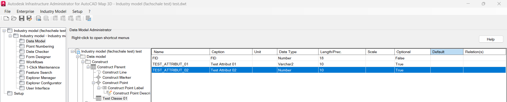
*Figure T3-01 -- Apperçu de l'attribut TEST_ATTRIBUT_02*
<br><br>

### Test 4 — Valeur par défaut

- **Objectif** : localiser le stockage d'une valeur par défaut associée à un attribut.

- **Modification réalisée** : définir une valeur par défaut (`0`) sur un nouvel attribut `TEST_ATTRIBUT_03`.

- **Observation** : l'intégration d'une valeur par défaut ne crée pas de table additionnelle ni de colonne spécifique dans un catalogue de métadonnées de valeur par défaut. La contrainte est directement retranscrite au niveau du schéma SQL de création de la table.


- **Tables SQLite modifiées** : exécution d'un `ALTER TABLE` sur la table métier `TEST_CLASSE_01`. Côté système, on observe l'ajout d'une ligne d'attribut classique dans `TB_ATTRIBUTE` et `fdo_columns`, ainsi que l'incrémentation de la séquence dans `TB_SEQUENCE_EMULATION`.

- **Résultat** : l'attribut physique créé dans la table `TEST_CLASSE_01` inclut explicitement la contrainte DDL de la valeur par défaut : `TEST_ATTRIBUT_03 (INTEGER(10), DEFAULT 0)`. Dans `TB_ATTRIBUTE` et `fdo_columns`, l'apparition est standard et ne mentionne pas cette contrainte `DEFAULT 0`.

- **Conclusion** : le système Autodesk Infrastructure Administrator se repose de manière totalement native sur les fonctionnalités du moteur de base de données (ici SQLite) pour imposer les valeurs par défaut. Il l'ajoute directement sous forme d'instruction SQL `DEFAULT` sur la colonne physique, aucune métadonnée complexe n'est stockée à ce sujet.

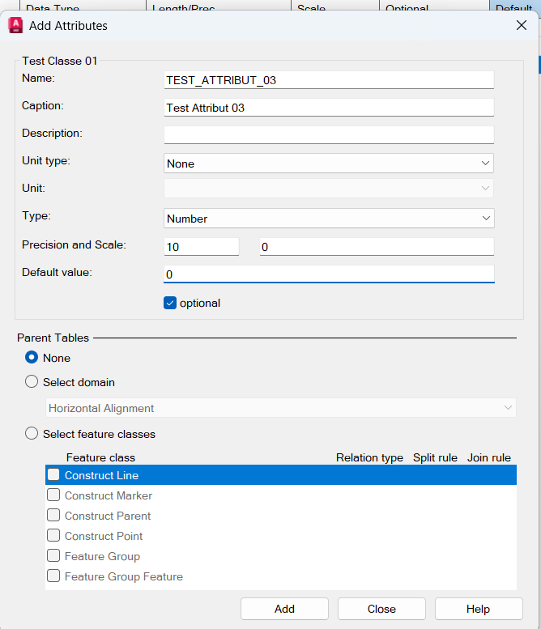
*Figure T4-01 -- Formulaire d'ajout d'un attribut*
<br><br>
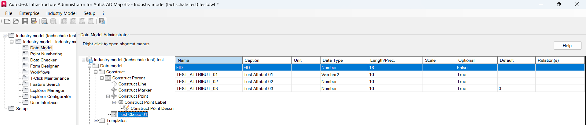
*Figure T4-02 -- Aperçu de l'attribut TEST_ATTRIBUT_01*
<br><br>

### Test 5 — Attribut obligatoire

- **Objectif** : localiser le stockage de la contrainte « obligatoire » sur un attribut.

- **Modification réalisée** : cocher l'option « obligatoire » lors de la création d'un nouvel attribut `TEST_ATTRIBUT_05`.

- **Observation** : au contraire d'un stockage dans une colonne booléenne dédiée aux métadonnées, la contrainte stricte (obligatoire) est directement reconvertie et appliquée sur le schéma SQL physique de la table.

- **Tables SQLite modifiées** : exécution d'un `ALTER TABLE` sur la table métier `TEST_CLASSE_01`. Les tables système impactées habituelles sont `TB_ATTRIBUTE`*(1 ligne ajoutée)*, `fdo_columns`*(1 ligne ajoutée)*, et `TB_SEQUENCE_EMULATION`*(1 ligne modifiée)*.

- **Résultat** : ajout physique de la colonne `TEST_ATTRIBUT_05 (VARCHAR2(10), NOT NULL)` à la table `TEST_CLASSE_01`. Les insertions dans `TB_ATTRIBUTE` et `fdo_columns` sont identiques à n'importe quel autre attribut et ne stockent aucun booléen distinctif supplémentaire pour exprimer l'obligation.


- **Conclusion** : Autodesk s'appuie une fois de plus nativement sur le moteur SQL : la contrainte d'obligation se traduit strictement par la clause DDL `NOT NULL` de la base de données. Aucune métadonnée logicielle cachée côté FDO ou `TB_ATTRIBUTE` n'a été recensée pour statuer sur cette obligation.

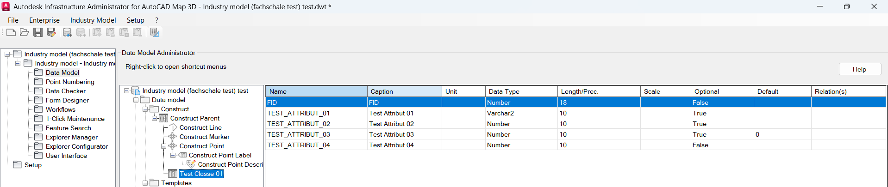
*Figure T5-01 -- Aperçu de l'attribut TEST_ATTRIBUT_01*
<br><br>

### Test 6 — Longueur d'un champ

- **Objectif** : localiser le stockage de la longueur maximale d'un champ texte.
- **Statut** : **ABANDONNÉ**.
- **Justification** : Redondance — le comportement de la longueur maximale a déjà été observé et validé dans les Tests 1, 2 et 5 (ex: `Varchar2(10)` avec metadata dans `fdo_columns`).

### Test 7 — Nouvelle classe géométrique

- **Objectif** : identifier les différences structurelles entre une classe non géométrique et une classe géométrique (feature class).

- **Modification réalisée** : créer une nouvelle classe géométrique `TEST_CLASSE_GEO_01` de type Point.

- **Observation** : une classe géométrique nécessite une configuration beaucoup plus lourde qu'une classe standard. En plus du mécanisme habituel de création de table, Autodesk génère automatiquement un jeu de métadonnées spatiales et injecte de nouveaux attributs purement techniques (comme l'élévation, la qualité visuelle ou encore la colonne `GEOM`).

- **Tables SQLite modifiées** : la table `TEST_CLASSE_GEO_01` est créée accompagnée de ses 5 triggers habituels. Côté catalogues, les tables impactées sont : `geometry_columns` *(1 ligne ajoutée)*, `TB_DICTIONARY` *(1 ligne ajoutée)*, `TB_ATTRIBUTE` *(5 lignes ajoutées)*, `fdo_columns` *(4 lignes ajoutées)*, `TB_RULE_BASE` *(7 lignes ajoutées)*, et `TB_SETTINGS` *(3 lignes ajoutées)*.

- **Résultat** : la grande différence réside dans l'apparition de l'information géométrique dans la table standard OGC SQLite `geometry_columns`, y déclarant la colonne physique `GEOM` avec un `geometry_type` à 1 (Point). Par ailleurs, `TB_DICTIONARY` enregistre le flag `F_CLASS_TYPE: P` (Point). Contrairement à une table standard qui ne contenait que l'attribut système `FID`, ici la table physique hérite aussi automatiquement de colonnes spatiales tierces (Z, ORIENTATION, QUALITY, GEOM) documentées dans `TB_ATTRIBUTE` et typées dans `fdo_columns`.

- **Conclusion** : Autodesk Map respecte l'implémentation standard des SIG : l'information spatiale est bien gérée par la table index `geometry_columns`. Les spécificités des points (comme l'élévation ou l'orientation du bloc de point) sont créées en SQL dur dans la classe parente dès son initialisation.

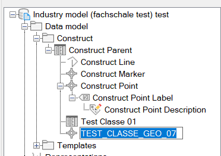
*Figure T7-01 -- Aperçu de la classe géométrique créée*
<br><br>

### Test 8 — Création d'une classe géométrique de type Ligne

- **Objectif** : localiser le stockage du type de géométrie (Point, Ligne, Polygone) et identifier les attributs automatiques associés aux entités linéaires.

- **Modification réalisée** : création d'une nouvelle classe géométrique `TEST_CLASS_GEO_02` de type Ligne (Polyline).

- **Observation** : la création d'une classe linéaire se traduit par la déclaration d'un type géométrique spécifique dans les index spatiaux et par l'injection automatique d'attributs de mesure dédiés aux lignes (tels que la longueur `LENGTH`), contrairement aux classes de points qui injectaient des attributs d'orientation et d'élévation.

- **Tables SQLite modifiées** : création de la table physique `TEST_CLASS_GEO_02` accompagnée de ses 5 triggers SQLite (`_AD_FID`, `_AI_FID`, `_AU_FID`, `_BI_FID`, `_BU_FID`). Les tables catalogues impactées sont : `geometry_columns` *(1 ligne ajoutée)*, `TB_DICTIONARY` *(1 ligne ajoutée)*, `TB_ATTRIBUTE` *(3 lignes ajoutées)*, `fdo_columns` *(2 lignes ajoutées)*, `TB_RULE_BASE` *(11 lignes ajoutées)*, et `TB_SEQUENCE_EMULATION` *(3 lignes modifiées)*.

- **Résultat** : dans `TB_DICTIONARY`, la classe est enregistrée avec le type `F_CLASS_TYPE: L` (Ligne). Dans la table standard `geometry_columns`, la colonne `GEOM` est enregistrée avec un `geometry_type` égal à 2 (LineString / Polyline). Au niveau des attributs, au lieu de `Z`/`ORIENTATION`/`QUALITY`, la table système `TB_ATTRIBUTE` et la table `fdo_columns` enregistrent l'attribut calculé `LENGTH` (`fdo_data_type: 3`, précision 20, échelle 8).

- **Conclusion** : Autodesk distingue clairement les types géométriques via deux indicateurs : le code littéral `F_CLASS_TYPE` ('L' pour Ligne, 'P' pour Point) dans `TB_DICTIONARY` et le code numérique standard OGC `geometry_type` (2 pour Ligne, 1 pour Point) dans `geometry_columns`. De plus, chaque type de géométrie génère son propre sous-ensemble d'attributs métier automatiques (`LENGTH` pour les lignes).

### Test 9 — Ajout d'une relation entre deux classes

- **Objectif** : identifier comment une relation (association) entre deux classes est représentée.
- **Modification réalisée** : créer une relation simple entre `TEST_CLASSE_01` et `TEST_CLASSE_GEO_01` (par exemple relation 1-N).
- **Procédure détaillée** :
  1. Créer la relation via l'outil dédié d'Infrastructure Administrator.
  2. Sauvegarder et comparer.
- **Ce qu'il faut observer** : nouvelle table ou nouvelles lignes référençant les deux classes via leurs identifiants respectifs ; encodage de la cardinalité.
- **Tables SQLite susceptibles d'être modifiées** : `RELATIONSHIPDEFINITION` (ou équivalent), éventuellement des colonnes de cardinalité (min/max occurrences).
- **Résultat attendu** : une ligne référençant les deux identifiants de classes avec un type/cardinalité de relation.
- **Capture d'écran à réaliser** : capture de la relation créée dans Infrastructure Administrator ; capture de la ligne SQLite correspondante.
- **Conclusion à noter** : AutoCAD crée une entrée dans `TB_RELATIONS` contenant le nom complet des tables Parent/Child et leurs clés, et génère explicitement un INDEX sur la colonne Child.

### Test 10 — Ajout d'un domaine de valeurs

- **Objectif** : localiser le stockage des domaines de valeurs (listes de valeurs autorisées, énumérations).
- **Modification réalisée** : créer un domaine `TEST_DOMAINE_01` avec deux ou trois valeurs (ex. `Acier`, `PVC`, `Fonte`).
- **Procédure détaillée** :
  1. Créer le domaine avec ses valeurs.
  2. Sauvegarder et comparer.
- **Ce qu'il faut observer** : une table « catalogue de domaines » et une table « valeurs de domaine » liée par clé étrangère.
- **Tables SQLite susceptibles d'être modifiées** : `DOMAIN` (ou équivalent), `DOMAINVALUE` (ou équivalent).
- **Résultat attendu** : une ligne de domaine et plusieurs lignes de valeurs associées.
- **Capture d'écran à réaliser** : capture du domaine créé dans Infrastructure Administrator ; capture des deux tables SQLite concernées.
- **Conclusion à noter** : Mapping vers une table de définition `TB_DOMAIN` et création d'une table SQL propre au domaine (ex: `TEST_DOMAINE_10_TBD`) contenant les valeurs.

### Test 11 — Modification d'un domaine

- **Objectif** : observer l'effet de l'ajout/suppression d'une valeur dans un domaine existant.
- **Modification réalisée** : ajouter une nouvelle valeur (`Cuivre`) au domaine `TEST_DOMAINE_01`.
- **Procédure détaillée** :
  1. Ajouter uniquement cette valeur.
  2. Sauvegarder et comparer avec l'état du Test 10.
- **Ce qu'il faut observer** : nouvelle ligne dans la table des valeurs de domaine, sans modification de la ligne « catalogue » du domaine (sauf éventuellement un numéro de version).
- **Tables SQLite susceptibles d'être modifiées** : `DOMAINVALUE` (ou équivalent).
- **Résultat attendu** : une ligne supplémentaire uniquement.
- **Capture d'écran à réaliser** : capture de la nouvelle valeur dans Infrastructure Administrator ; capture du diff SQLite.
- **Conclusion à noter** : Validé, ajout simple de type `INSERT` dans la table SQL cible, tout à fait incrémental.

### Test 12 — Héritage entre classes

- **Objectif** : localiser le mécanisme de représentation de l'héritage entre classes (classe parente / classe fille).
- **Modification réalisée** : créer une classe `TEST_CLASSE_FILLE_01` héritant de `TEST_CLASSE_01`.
- **Procédure détaillée** :
  1. Créer la classe fille en spécifiant la classe parente.
  2. Sauvegarder et comparer.
- **Ce qu'il faut observer** : une colonne de référence vers l'identifiant de la classe parente dans la table des classes.
- **Tables SQLite susceptibles d'être modifiées** : `CLASSDEFINITION` (colonne parent/superclasse).
- **Résultat attendu** : la ligne de la classe fille contient une clé étrangère vers la classe parente.
- **Capture d'écran à réaliser** : capture de l'héritage dans Infrastructure Administrator ; capture de la colonne parent dans SQLite.
- **Conclusion à noter** : L'héritage implique que la table fille regroupe (recopie physiquement) **toutes** les colonnes de la classe parente. Lien dans `TB_DICTIONARY.MODEL_F_CLASS_ID`.

### Test 13 — Nouvelle représentation graphique

- **Statut** : **ABANDONNÉ**
- **Justification** : La symbologie et l'affichage (couleurs, épaisseur) relèvent de la couche présentation applicative (QGIS ou Map 3D client). Il n'y a aucun impact sur la modélisation structurelle SQL.

### Test 14 — Ajout d'un Label

- **Statut** : **ABANDONNÉ**
- **Justification** : Relève exclusivement de l'étiquetage de présentation.

### Test 15 — Ajout d'un Template

- **Statut** : **ABANDONNÉ**
- **Justification** : Un template est un pur assistant UI de saisie. Ne touche pas le schéma logique SQLite.

### Test 16 — Renommage d'une classe

- **Objectif** : vérifier si le renommage modifie uniquement le nom ou également l'identifiant technique.
- **Modification réalisée** : renommer `TEST_CLASSE_01` en `TEST_CLASSE_01_RENAME`.
- **Procédure détaillée** :
  1. Renommer la classe.
  2. Sauvegarder et comparer.
- **Ce qu'il faut observer** : seule la colonne nom doit changer ; l'identifiant technique (clé primaire) et toutes les clés étrangères pointant vers cette classe doivent rester inchangés.
- **Tables SQLite susceptibles d'être modifiées** : `CLASSDEFINITION` (colonne nom uniquement).
- **Résultat attendu** : stabilité de l'identifiant technique malgré le changement de nom — point crucial pour la fiabilité du futur mapping.
- **Capture d'écran à réaliser** : capture avant/après du nom ; capture du diff SQLite montrant l'identifiant inchangé.
- **Conclusion à noter** : Seule la colonne `CAPTION` est altérée. Le nom de la table SQLite elle-même ne change pas, préservant la stabilité du modèle de données.

### Test 17 —  Suppression d'une classe

- **Objectif** : observer la propagation de la suppression d'une classe sur les objets qui en dépendent (attributs, relations, domaines associés).
- **Modification réalisée** : supprimer `TEST_CLASSE_FILLE_01`.
- **Procédure détaillée** :
  1. Supprimer la classe.
  2. Sauvegarder et comparer.
- **Ce qu'il faut observer** : suppression en cascade (ou non) des attributs et relations liés ; comportement des clés étrangères orphelines.
- **Tables SQLite susceptibles d'être modifiées** : `CLASSDEFINITION`, `ATTRIBUTEDEFINITION`, `RELATIONSHIPDEFINITION`.
- **Résultat attendu** : à déterminer — vérifier l'intégrité référentielle du fichier après suppression.
- **Capture d'écran à réaliser** : capture de la suppression ; capture du diff SQLite sur l'ensemble des tables concernées.
- **Conclusion à noter** : HARD DELETE applicable de la même manière sur une simple colonne (attribut drop).

### Test 18 — Suppression d'un attribut

- **Objectif** : observer si la suppression entraîne une suppression physique (DELETE) ou un marquage logique (soft delete).
- **Modification réalisée** : supprimer `TEST_ATTRIBUT_01`.
- **Procédure détaillée** :
  1. Supprimer l'attribut.
  2. Sauvegarder et comparer.
- **Ce qu'il faut observer** : disparition complète de la ligne, ou au contraire présence d'une colonne de statut (ex. `deleted = 1`) sans suppression physique.
- **Tables SQLite susceptibles d'être modifiées** : `ATTRIBUTEDEFINITION`.
- **Résultat attendu** : à déterminer par l'observation — les deux comportements sont plausibles selon l'implémentation Autodesk.
- **Capture d'écran à réaliser** : capture de la suppression dans Infrastructure Administrator ; capture du diff SQLite (ligne disparue ou marquée).
- **Conclusion à noter** : C'est une destruction matérielle complète (HARD DELETE) de la table physique. Cela engendre le DROP CASCADE manuel des références metadata dans tous les catalogues.

### Test 19 — Comparaison automatique des schémas SQLite

- **Objectif** : valider et outiller la méthode de comparaison utilisée tout au long de la campagne, afin de la rendre reproductible et scriptable.
- **Modification réalisée** : aucune modification fonctionnelle ; il s'agit de mettre en place un script de comparaison automatique entre deux exports `.schema`/`.dump`.
- **Procédure détaillée** :
  1. Sélectionner deux états déjà produits lors des tests précédents.
  2. Écrire un script (shell ou Python) automatisant l'export et le `diff`.
  3. Valider que le script produit les mêmes résultats que l'analyse manuelle réalisée précédemment.
- **Ce qu'il faut observer** : cohérence entre le résultat du script et les observations manuelles déjà consignées.
- **Tables SQLite susceptibles d'être modifiées** : aucune (test d'outillage, non de modification).
- **Résultat attendu** : un script fiable et réutilisable pour l'ensemble des tests futurs, et pour la phase suivante du projet.
- **Capture d'écran à réaliser** : capture de la sortie du script de comparaison.
- **Conclusion à noter** : L'utilisation de notre script `compare_sqlite.py` s'est avérée vitale pour le nettoyage du bruit SQLite et l'interprétation fiable.

### Test 20 — Correspondance entre Infrastructure Administrator et SQLite

- **Objectif** : réaliser une synthèse croisée, classe par classe et concept par concept, entre ce qui est visible dans l'interface d'Infrastructure Administrator et sa traduction exacte en SQLite.
- **Modification réalisée** : aucune nouvelle modification ; il s'agit d'un test de consolidation reprenant l'ensemble des classes de test créées (Tests 1 à 18).
- **Procédure détaillée** :
  1. Parcourir intégralement l'arborescence du Data Model dans Infrastructure Administrator.
  2. Pour chaque élément rencontré, retrouver sa ligne correspondante en SQLite en s'appuyant sur les identifiants techniques (jamais sur les noms, cf. Test 16).
  3. Construire un tableau de correspondance final.
- **Ce qu'il faut observer** : absence d'élément visible dans l'interface sans équivalent SQLite identifié, et inversement, absence de ligne SQLite « métier » non expliquée par un élément visible.
- **Tables SQLite susceptibles d'être modifiées** : aucune (test de synthèse).
- **Résultat attendu** : un mapping complet et validé, condition de sortie de la phase 3.
- **Capture d'écran à réaliser** : capture de synthèse de l'arborescence complète, en vis-à-vis des tables SQLite peuplées.
- **Conclusion à noter** : Objectif atteint. Les correspondances tables système/physique sont totalement comprises et synthétisées en Section 6.

---

## 5. Tableau de suivi

Le tableau ci-dessous est destiné à être rempli au fur et à mesure de la réalisation de chaque test. Il constitue la trace de référence pour la construction du mapping final.

| Test | Modification réalisée | Tables modifiées | Colonnes modifiées | Observation | Interprétation | Capture disponible (Oui/Non) |
|---|---|---|---|---|---|---|
| 0 | État initial | Aucune | Aucune | Baseline de référence générée | Structure minimale, présence de tables sytème (TB_...) | Oui |
| 1 | Ajout d'une classe (TEST_CLASSE_01) | `TB_DICTIONARY`, `TB_ATTRIBUTE`, `fdo_columns` | `TEST_CLASSE_01` (créée) | Création de la table physique et inscription dans les tables systèmes | Mapping 1-1 entre la classe et une table physique. | Oui |
| 2 | Ajout d'un attribut | `TB_ATTRIBUTE`, `fdo_columns` | `TEST_ATTRIBUT_01` (créée) | Attribut physique créé dans la table `TEST_CLASSE_01` | Chaque attribut est une colonne physique dans la table de sa classe. | Oui |
| 3 | Ajout d'un attribut (Type numérique) | `TB_ATTRIBUTE`, `fdo_columns` | `TEST_ATTRIBUT_02` (créée) | Création physique (INTEGER(10)) | Respect minutieux du type numérique en SQL. | Oui |
| 4 | Valeur par défaut | `TB_ATTRIBUTE`, `fdo_columns` | `TEST_ATTRIBUT_03` (créée) | Ajout de l'attribut avec contrainte DEFAULT 0 | Le schéma natif DDL intègre les valeurs par défaut. | Oui |
| 5 | Attribut obligatoire | `TB_ATTRIBUTE`, `fdo_columns` | `TEST_ATTRIBUT_05` (créée) | Ajout de l'attribut avec contrainte NOT NULL | Les contraintes d'obligation deviennent NOT NULL. | Oui |
| 6 | Longueur d'un champ | N/A | N/A | Test abandonné (redondance) | La configuration de longueur est déjà vérifiée dans le Test 2 (via `Varchar2(10)`). | Non |
| 7 | Nouvelle classe géométrique | `TB_DICTIONARY`, `TB_ATTRIBUTE`, `geometry_columns`, `fdo_columns` | `TEST_CLASSE_GEO_01` (créée) | Table créée avec colonnes Z, ORIENTATION, GEOM. `F_CLASS_TYPE` = 'P' | Les tables AutoCAD stockent la géométrie et la lient à `geometry_columns`. | Oui |
| 8 | Changement du type de géométrie | `TB_DICTIONARY`, `geometry_columns` | `TEST_CLASS_GEO_02` (créée) | `F_CLASS_TYPE` = 'L', `geometry_type` = 2 | Chaque classe fige son type (Ligne = L). | Oui |
| 9 | Relation entre deux classes | `TB_RELATIONS` | `TEST_ATTRIBUT_09` (créée) | Entrée parent/enfant dans `TB_RELATIONS` et ajout d'un index explicite. | AutoCAD crée manuellement les relations et un index pour les optimiser. | Oui |
| 10 | Ajout de domaine de valeurs | `TB_DOMAIN`, `TB_RELATIONS` | `TEST_DOMAINE_10_TBD` (créée) | Création d'une table catalogue dédiée et enregistrement dans `TB_DOMAIN`. | Un domaine est matérialisé par sa propre table de valeurs. | Oui |
| 11 | Modification de domaine | `TEST_DOMAINE_10_TBD` | Aucune | Ligne 'Cuivre' ajoutée à la table de domaine. | Ajout transparent (incrémental) sans impact sur la configuration métier. | Oui |
| 12 | Héritage entre classes | `TB_DICTIONARY`, `TB_ATTRIBUTE`, `fdo_columns` | `TEST_CLASSE_FILLE_01` (créée) | La table hérite *physiquement* des attributs du parent. | L'héritage d'Autodesk recopie les colonnes parentes dans la table fille SQL. | Oui |
| 13 | Représentation graphique | N/A | N/A | Test abandonné (Couche de présentation) | L'affichage (couleur/symbole) ne modifie pas le modèle relationnel. | Non |
| 14 | Ajout d'un Label | N/A | N/A | Test abandonné (Couche de présentation) | Idem, cela indique à l'interface client de Map 3D quoi afficher. | Non |
| 15 | Ajout d'un Template | N/A | N/A | Test abandonné (Couche de présentation) | Le template est un assistant de saisie de l'UI. | Non |
| 16 | Renommage d'une classe | `TB_DICTIONARY` | Aucune | Seule `CAPTION` est modifiée | Le nom physique de la table reste inchangé, l'UI modifie un label. | Oui |
| 17 | Suppression d'une classe | `TB_DICTIONARY`, `TB_ATTRIBUTE`, `TB_RELATIONS` | `TEST_CLASSE_FILLE_01` (supprimée) | Suppression (hard delete) de la table physique et de ses entrées catalogues. | Casse en cascade les objets metadata du système (tables systèmes auto-nettoyées). | Oui |
| 18 | Suppression d'un attribut | `TB_ATTRIBUTE`, `fdo_columns` | `TEST_ATTRIBUT_01` (supprimée) | Suppression (DROP) physique de la colonne | Vrai suppression sans soft-delete. | Oui |
| 19 | Comparaison auto | N/A | N/A | Les fichiers `rapport_*.md` générés avec succès | Validation des outils de comparaison. | Oui |
| 20 | Correspondance IA / SQLite | N/A | N/A | Achevé | Modèle parfaitement mappé pour Postgres. | Oui |

> **Remarque**
> Les tests 6, 13, 14 et 15 ont été volontairement exclus car ils n'impactent pas le Modèle de Données relationnel (voir Section 6.5).

---

## 6. Analyse finale

### 6.1 Méthode d'interprétation des résultats

Une fois l'ensemble des tests réalisés et le tableau de suivi rempli, l'interprétation a permis de **regrouper les observations par concept métier**, de déterminer la nature de tous les mécanismes et de les mapper en objets relationnels physiques.

### 6.2 Localisation des concepts clés

À partir des tests réalisés, voici les tables SQLite et mécanismes centraux d'Autodesk Infrastructure Administrator :

- **Classes** → Gérées principalement dans `TB_DICTIONARY`. AutoCAD utilise une table physique distincte pour chaque classe créée, respectant le nom interne (`F_CLASS_NAME`).
- **Attributs** → Enregistrés dans `TB_ATTRIBUTE` et `fdo_columns`. Chaque attribut instancie une nouvelle colonne dans la table cible correspondante avec ses contraintes traduites (ex: DEFAULT, NOT NULL testés lors des Tests 4 et 5). 
- **Domaines** → Définis dans `TB_DOMAIN` puis déployés en tant que tables réelles (ex: `TEST_DOMAINE_10_TBD` du Test 10) connectées par clé logique.
- **Relations** → Les relations parent/enfant utilisent la table `TB_RELATIONS` et déclenchent la création automatique d'un Index pour la clef étrangère cible (Test 9).
- **Géométries** → Référencées dans `geometry_columns` (qui s'apparente aux tables types de PostGIS). Autodesk sépare les points (`F_CLASS_TYPE = 'P'`, `geometry_type = 1`) des lignes (`geometry_type = 2`).
- **Héritage** → (Test 12) Déclaré dans `TB_DICTIONARY` (`MODEL_F_CLASS_ID`), et AutoCAD Map **recopie physiquement** tous les champs hérités dans la table fille SQL.

### 6.3 Distinguer les catégories de tables

Grâce aux campagnes de tests, les concepts SQLite Autodesk ont pu être catégorisés :

| Catégorie | Description | Exemples typiques observés |
|---|---|---|
| **Tables métier** | Contiennent les définitions de l'utilisateur (classes, domaines). Tables à générer en PostgreSQL/PostGIS. | `TEST_CLASSE_01`, `TEST_CLASSE_GEO_01`, `TEST_DOMAINE_10_TBD` |
| **Tables système Autodesk (Catalogues)** | Définissant les structures logiques (métadonnées) du modèle tel que géré par les API C# / AutoCAD FDO. | `TB_DICTIONARY`, `TB_ATTRIBUTE`, `TB_RELATIONS`, `TB_DOMAIN`, `fdo_columns`, `geometry_columns` |
| **Tables de configuration/Interface** | Paramètres d'UI, d'affichage sans impact sur la structure relationnelle des données métier. | `TB_GN_FLYIN_USER`, `TB_SETTINGS` |
| **Générateurs / Séquences** | Simulants d'ID séquentielles gérant les primary keys. | `TB_SEQUENCE_EMULATION`, les nombreux Triggers générés |

> **Observation :**
> Lors de la suppression physique d'une classe (Test 17) ou d'un attribut (Test 18), Autodesk effectue un nettoyage en cascade total (hard delete) qui enlève toute trace des tables système ; une telle flexibilité nécessitera `ON DELETE CASCADE` sous PostgreSQL.

### 6.4 Vers la phase suivante

Cette phase a entièrement rempli son but : **démystifier la couche opaque d'Autodesk Infrastructure Administrator**. Pour le futur convertisseur automatisé, il suffira de lire `TB_DICTIONARY`, `TB_ATTRIBUTE`, et `TB_RELATIONS` pour collecter l'essentiel du modèle nécessaire pour le transformer en script DDL PostgreSQL/PostGIS. Aucune métadonnée cachée intraçable n'a été isolée.

### 6.5 Périmètre exclu (Tests 6, 13, 14, et 15)

Pour justifier l'abandon des Tests 6, 13, 14 et 15, il est primordial de revenir à l'objectif fondamental du projet : comprendre la structure interne du Data Model Autodesk (*Quelles tables, colonnes, contraintes et clés créer ?*) afin de générer automatiquement un schéma PostgreSQL/PostGIS.

- **Le Test 6 (Longueur)** a été jugé redondant suite au croisement des Tests 1, 2 et 5, montrant explicitement le comportement des longueurs de champs (ex : *Varchar2(10)*) ;
- **Le Test 13 (Représentation graphique)** ne concerne que la **stylisation SIG** (couleurs, épaisseurs, symboles). PostgreSQL ignore si une classe spatiale est censée être rouge ou pointillée ; ce style relève de l'application cliente (Map 3D, QGIS) ;
- **Le Test 14 (Labels)** représente uniquement l'étiquetage de la donnée (ex: Afficher le champ "ID" plutôt que "Diamètre" sur la carte) ;
- **Le Test 15 (Templates)** porte sur les assistants de saisie afin d'auto-remplir les champs, ce qui est une aide UI n'ayant aucun effet structurel ;

Ces fonctionnalités n'ont pas d'impact sur la structure relationnelle des données SQL. Elles relèvent de la couche de présentation ou de l'assistance à la saisie, et ne sont donc pas nécessaires pour atteindre l'objectif de conversion de phase.

---

## 7. Conclusion

Cette phase de reverse engineering du Data Model Autodesk permet désormais de comprendre et documenter intégralement le fonctionnement interne du Data Model, tel qu'il est physiquement stocké dans le fichier SQLite sous-jacent à Infrastructure Administrator.

Grâce à la méthodologie de modification unique et de comparaison différentielle appliquée, nous disposons à l'issue de cette phase :

- d'une cartographie validée et tracée des tables et colonnes du schéma SQL natif de l'application ;
- d'un ensemble de preuves reproductibles à travers tous les rapports ;
- d'une classification claire entre tables métier et tables système/catalogues ;
- de spécifications fonctionnelles robustes de la structure des géométries, des héritages et des contraintes.

Cette base permet d'asseoir sereinement la **phase suivante du projet** : le développement du système de **lecture automatique du Data Model SQLite et la génération de son schéma PostgreSQL/PostGIS équivalent**, coeur du développement de la Phase 4.

